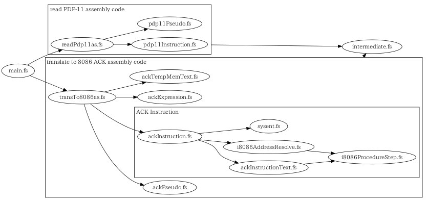

## プログラム概要

* トランスレータのプログラムの概要を記します。

### main.fs

1. 入力されたPDP-11のアセンブリ言語の文字列を読み、中間物(intermediate)の形式にします。
2. 中間物を8086 ACKアセンブリ言語の文字列に変換します。

### readPdp11as.fs

* PDP-11アセンブリ言語を解釈します。
* 疑似命令(Pseudo)と命令(Instruction)の解釈は、それぞれ別ファイルで実装されています。

### transTo8086as.fs

* 8086 ACKアセンブリ言語に変換します。
* 疑似命令(Pseudo)、命令(Instruction)、演算式(Expression)の変換は、それぞれ別ファイルで実装されています。
* 命令の変換はボリュームの関係から、複数ファイルで処理を分担しています。
* 変換のために一時的にデータ領域のメモリを使う場合があります。その必要がある場合に、ackTempMemText.fsのプログラムが、メモリ領域を確保する文字列を生成します。（あまり本質的な箇所ではありません）

